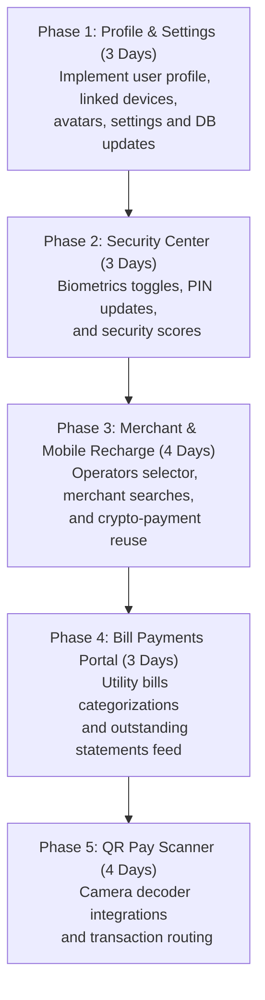

# Feature Implementation Roadmap: Mockups to Working Flow

This document outlines the architectural plan, database requirements, new components, and execution sequence to transition the placeholder pages into fully integrated database-connected features, using the project screenshots as the visual source of truth.

---

## 🏗️ Reusable Core Architecture

To avoid code duplication and ensure safety, all payment-related features (Merchant, Recharge, Bills, QR Pay) **must reuse the existing cryptographic transaction flow**:
*   **HMAC integrity checks** to produce payload validations ($F1 / F2$).
*   **AES encryption** using stretched keys ($K2$), biometric fingerprint tokens ($BP$), and timestamp locks ($T$).
*   **Rotational security updates** that update user session counters on success to prevent replay threats.

---

## 📋 Feature-by-Feature Blueprints

### 1. Merchant Payment
*   **Current Implementation:** Redirects to the generic `/send-money` form with a category label state.
*   **Screenshot Reference:** [`screenshots/13-merchant-payment.png`](file:///E:/Apps/Sohan/E_PAY/e_banking/screenshots/13-merchant-payment.png)
*   **Missing UI:**
    *   Search input box with search icon and placeholder `Enter merchant name or ID`.
    *   "Recommended Merchants" tag lists (e.g. Amazon, Walmart).
    *   "Recent Merchants" list showing business titles, classifications, initials avatars (SM, TH, CC), and arrow icons.
*   **Missing Backend:** `@app.route('/merchants', methods=['GET'])` to return lists of verified merchants and recent transaction counts.
*   **Missing Database:** A `merchants` table in Supabase listing name, merchant_id, category, and avatar_colors, or query profile flags where `is_merchant = true`.
*   **Missing Routes:** `/merchant` (registered in `App.tsx`).
*   **Reusable Code:** `processTransfer` API bindings, `Input` forms, and `TransactionCard` styling assets.
*   **New Components Needed:** `MerchantSearch`, `RecommendedMerchants`, `RecentMerchantsList`.
*   **Estimated Effort:** **2 Days**
*   **Completion % After Implementation:** **100%**

---

### 2. Mobile Recharge
*   **Current Implementation:** Redirects to the generic `/send-money` form.
*   **Screenshot Reference:** [`screenshots/11-recharge.png`](file:///E:/Apps/Sohan/E_PAY/e_banking/screenshots/11-recharge.png)
*   **Missing UI:**
    *   Phone number input field with a smartphone icon.
    *   "Select Operator" selection list showing operators: Grameenphone (blue square), Robi (red), Banglalink (orange), Airtel (pink), Teletalk (green).
    *   "Continue to Amount" primary action button.
*   **Missing Backend:** Operator validation endpoints and recharge balance transaction logs.
*   **Missing Database:** `operators` directory and ledger accounts.
*   **Missing Routes:** `/recharge`.
*   **Reusable Code:** `processTransfer` API, `Input` components, and `Button` layouts.
*   **New Components Needed:** `OperatorSelectionGrid`, `RechargeForm`.
*   **Estimated Effort:** **2 Days**
*   **Completion % After Implementation:** **100%**

---

### 3. Bill Payment
*   **Current Implementation:** Redirects to the generic `/send-money` form.
*   **Screenshot Reference:** [`screenshots/12-bills.png`](file:///E:/Apps/Sohan/E_PAY/e_banking/screenshots/12-bills.png)
*   **Missing UI:**
    *   "Categories" grid showcasing utility icons: Electricity, Water, Internet, Television, Gas, Insurance.
    *   "Pending Bills" feed displaying outstanding invoices or "You're all caught up!" empty states with circular green checkmarks.
*   **Missing Backend:** `@app.route('/bills/<username>', methods=['GET'])` to retrieve outstanding invoices for a user.
*   **Missing Database:** A `bills` ledger table in Supabase containing fields: `id`, `profile_id`, `provider_name`, `amount`, `due_date`, `is_paid`, and `invoice_ref`.
*   **Missing Routes:** `/bills`.
*   **Reusable Code:** `processTransfer` API, `DailyLimitIndicator` bar, and empty state layout styles.
*   **New Components Needed:** `BillCategoriesGrid`, `PendingBillsFeed`, `EmptyBillsIndicator`.
*   **Estimated Effort:** **3 Days**
*   **Completion % After Implementation:** **100%**

---

### 4. User Profile
*   **Current Implementation:** Redirects to the mock features tab `/features`.
*   **Screenshot Reference:** [`screenshots/14-profile.png`](file:///E:/Apps/Sohan/E_PAY/e_banking/screenshots/14-profile.png)
*   **Missing UI:**
    *   User avatar display with camera photo uploader overlay.
    *   Verified account badge indicator.
    *   Personal Information cards with "Edit" actions (Email, Phone).
    *   "Linked Devices" list indicating current active device and last-login timestamps.
    *   "Logout from all devices" border action button.
*   **Missing Backend:** Avatar file-upload endpoint (`/user/avatar`) linked to Supabase storage, and device-invalidation endpoints.
*   **Missing Database:** `user_devices` table tracking session token, device description, IP address, and last-login date.
*   **Missing Routes:** `/profile`.
*   **Reusable Code:** `getUserSession()` utilities, `Button` styles.
*   **New Components Needed:** `ProfileHeader`, `PersonalInfoForm`, `LinkedDevicesList`.
*   **Estimated Effort:** **3 Days**
*   **Completion % After Implementation:** **100%**

---

### 5. Security Center
*   **Current Implementation:** Redirects to the mock features tab `/features`.
*   **Screenshot Reference:** [`screenshots/15-security.png`](file:///E:/Apps/Sohan/E_PAY/e_banking/screenshots/15-security.png)
*   **Missing UI:**
    *   "Authentication" card showing Security PIN ("Change" trigger), Fingerprint login switch, and Face ID switch.
    *   "Data & Privacy" status indicators (Encryption Status tags, Login Activity review links).
    *   "Security Score" blue container showing a percentage progress bar (e.g. 85%) and "Improve Score" actions.
    *   "Recovery Key" container with a "View Key" trigger.
*   **Missing Backend:** `@app.route('/user/security', methods=['POST'])` to update credentials, toggle biometric flags, or retrieve recovery keys.
*   **Missing Database:** Columns in the `profiles` table to store biometrics flags and stretched encryption PIN hashes.
*   **Missing Routes:** `/security`.
*   **Reusable Code:** `SecurityBadge` controls, standard switches, and progress bar trackers.
*   **New Components Needed:** `SecurityScoreCard`, `SecuritySettingsList`, `RecoveryKeyWidget`.
*   **Estimated Effort:** **3 Days**
*   **Completion % After Implementation:** **100%**

---

### 6. Settings
*   **Current Implementation:** Redirects to the mock features tab `/features`.
*   **Screenshot Reference:** [`screenshots/16-settings.png`](file:///E:/Apps/Sohan/E_PAY/e_banking/screenshots/16-settings.png)
*   **Missing UI:**
    *   "Display & Appearance" options (Language selector, Theme Mode switch).
    *   "Preferences" settings cards (Display Name editor, Notifications parameters, App Version badge).
    *   Action triggers at the bottom right: "Discard Changes" and "Save Preferences".
*   **Missing Backend:** Preference patch endpoints `/user/preferences`.
*   **Missing Database:** `profiles` table preference columns (`display_name`, `language`, `theme_preference`).
*   **Missing Routes:** `/settings`.
*   **Reusable Code:** Theme variables toggle logic (`theme.css`) and standard inputs.
*   **New Components Needed:** `PreferencesPanel`, `ThemeSwitcherWidget`.
*   **Estimated Effort:** **2 Days**
*   **Completion % After Implementation:** **100%**

---

### 7. QR Pay / Scanner
*   **Current Implementation:** Static `setTimeout` mockup inside `/features` list.
*   **Screenshot Reference:** None.
*   **Missing UI:** Camera viewfinder overlay, barcode scanner grid, and scan success modal.
*   **Missing Backend:** Decryption and confirmation verification endpoints.
*   **Missing Database:** None (shares core accounts ledger).
*   **Missing Routes:** `/qr-pay`.
*   **Reusable Code:** Cryptographic transaction flow (`processTransfer`).
*   **New Components Needed:** `CameraViewfinderOverlay`, `BarcodeScannerContainer`.
*   **Estimated Effort:** **4 Days**
*   **Completion % After Implementation:** **100%**

---

## 🏆 Recommended Implementation Sequence

To minimize integration issues, develop metadata-storing tables first, followed by payment portals:

