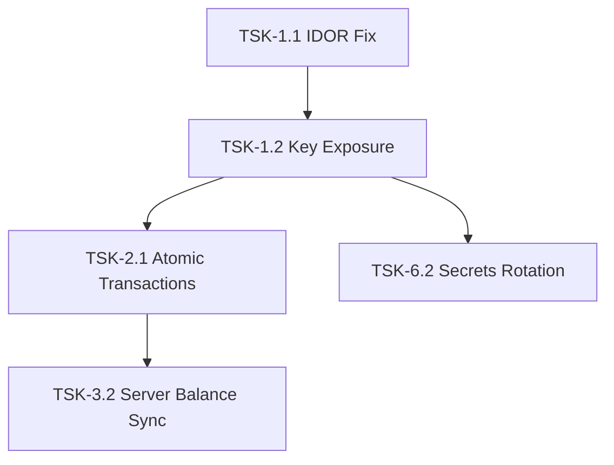

# MASTER CONTEXT: E-Banking Project Memory

This document serves as the single source of truth and permanent memory for the E-Banking / E-Pay thesis prototype application. It outlines the complete system architecture, security workflows, route inventories, known issues, development roadmaps, and coding rules.

---

## 1. Project Summary
*   **Project Name:** E-Banking / E-Payment (Vite Name: `@figma/my-make-file`)
*   **Purpose:** Implementation of the ICECTE 2022 research paper *"E-Payment System to Reduce Use of Paper Money for Daily Transactions"*.
*   **Core Concept:** A 3-factor, OTP-free digital wallet authentication system tailored for secure, low-value petty cash transactions (capped at ৳5,000.00 BDT daily limit). It uses device-bound keys ($K1$), private password keys ($K2$), biometric templates ($BP$), and rotating timestamps ($T$) to prevent replay attacks and secure transfers over insecure communication channels without SMS or cellular network verification.

---

## 2. System Architecture
The application is structured as a **decoupled Client-Server Single Page Application (SPA)** that coordinates with a PostgreSQL cloud database:

```
┌──────────────────┐               ┌──────────────────┐               ┌──────────────────┐
│  React Frontend  │ ◄───────────► │  Flask API Host  │ ◄───────────► │  Supabase Cloud  │
│  (Client Crypto) │  HTTPS / API  │  (Server Crypto) │  SQL / SDK    │  (Postgres DB)   │
└──────────────────┘               └──────────────────┘               └──────────────────┘
```

*   **Execution Separation:** The client is responsible for capturing inputs (passwords, biometrics) and executing client-side encryption and HMAC calculation. The backend acts as the secure execution environment, decrypting requests, verifying message integrity, and committing ledger adjustments.

---

## 3. Frontend Architecture
*   **Engine & Bundler:** Vite + TypeScript compiled to static assets inside `frontend/dist/`.
*   **Application Model:** React single-page application utilizing React Router.
*   **Routing System:** Static screen-to-screen routing (defined in [frontend/src/app/App.tsx](file:///E:/Apps/Sohan/E_PAY/e_banking/frontend/src/app/App.tsx)).
*   **Styling & Themes:** Tailwind CSS using custom color tokens (`#0D7C66` primary deep teal).
*   **Session Management:** User parameters (auth tokens, balance, usernames) are loaded in browser session states and persistently mapped (or temporarily held for keys).
*   **Client Crypto:** Executes `crypto-js` calls inside [crypto.ts](file:///E:/Apps/Sohan/E_PAY/e_banking/frontend/src/utils/crypto.ts).

---

## 4. Backend Architecture
*   **Server Framework:** Flask. Runs on a preferred port (default `5001`) with optional TLS configurations.
*   **CORS Policy:** Wildcard enabled (to be restricted).
*   **API Middleware:** Endpoint protection is implemented using a custom python decorator (`require_auth`) validating tokens against an in-memory session mapping:
    ```python
    active_sessions: dict[str, str] = {} # token -> username
    ```
*   **Crypto Engine:** [backend/crypto.py](file:///E:/Apps/Sohan/E_PAY/e_banking/backend/crypto.py) executes decryption, key derivation, and signature verifications wrapping `pycryptodome` library primitives.
*   **Supabase Integration:** Communicates with remote tables using the Python `supabase` SDK, utilizing `SUPABASE_SERVICE_ROLE_KEY` to bypass Row-Level Security during admin actions (like user registration).

---

## 5. Database Architecture
*   **Engine:** Hosted PostgreSQL v15+ on Supabase.
*   **Data Layout:** Relational schema. Foreign key cascade constraints link user credentials to account ledgers, audit trails, and notification systems.
*   **Row-Level Security (RLS):** Enabled on public tables. Direct Supabase REST operations are restricted using matching Policies (matching profile ID to the authenticated user UID).
*   **Index Optimizations:** Composite and descending indexes are defined on registration numbers, account references, transaction timestamps, and notification logs.

---

## 6. Authentication Flow

```
User Input Credentials (Username, Password)
                 │
                 ▼
       POST Request to /login
                 │
                 ▼
    Verify Password Hash (Flask)
                 │
                 ▼
 Generate UUID Session Token & Map in memory
                 │
                 ▼
 Return Token & Keys (K1, K2, BP, T) to Client
```

---

## 7. Transaction Flow

```
1. Input Receiver & BDT Amount
                 │
                 ▼
2. Verify Fingerprint Biometric (BP)
                 │
                 ▼
3. Client encrypts Payload using derived AES Key
                 │
                 ▼
4. POST Request with Payload, IV, & T sent to /transfer
                 │
                 ▼
5. Server validates T (T > Last_T and |T_srv - T| <= 180s)
                 │
                 ▼
6. Server decrypts Payload and compares F1 == F2 (HMAC)
                 │
                 ▼
7. Server checks balances and commits transfers
                 │
                 ▼
8. Update Last_T = T & Return success status
```

---

## 8. Cryptographic Flow & Formulas

### 8.1 Key Derivation (Registration)
*   **Device Key ($K1$):** Bind activation parameters, NID/BRC, and device identities:
    $$K1 = \text{HMAC-SHA256}(\text{Activation\_Code} \parallel \text{NID}, \text{MAC\_Address} \parallel \text{BP\_hash})$$
*   **Stretched Password ($K2$):** Protect user passwords using PBKDF2:
    $$K2 = \text{PBKDF2}(\text{password}, \text{NID}, \text{iterations}=100000)$$

### 8.2 Encryption & Signing (User Side)
*   **Derived AES Key:** Rotates dynamically based on fingerprint and timestamp:
    $$AES\_Key = \text{HMAC-SHA256}(K2, BP \parallel T)$$
*   **HMAC Signature ($F1$):** Secures the message content $M$:
    $$F1 = \text{HMAC-SHA256}(K1, M)$$
*   **Ciphertext Generation:** AES-256-CBC encryption:
    $$\text{Ciphertext} = \text{AES-256-CBC}(AES\_Key, IV, M \parallel F1)$$

### 8.3 Verification (Server Side)
*   **Decryption:** Server reconstructs $AES\_Key$ using stored credentials and received $T$, then decrypts the ciphertext.
*   **HMAC Validation ($F2$):** Server recomputes $F2$ and asserts:
    $$F2 = \text{HMAC-SHA256}(K1_{stored}, M_{decrypted})$$
    $$\text{Verify: } F1 == F2$$

---

## 9. Security Model
*   **Multi-Factor (OTP-Free):** Authenticates transfers using something you have ($K1$), something you know ($K2$), and something you are ($BP$).
*   **Replay Protection:** Prevents duplicate packet injection by enforcing strict chronological timestamp ordering ($T > \text{Last\_T}$) and rejecting packets with a timestamp drift greater than 180 seconds.
*   **Database Isolation:** Protects user data by utilizing Supabase RLS policies and routing database updates through the Flask backend.

---

## 10. User Roles
1.  **End-User:** Primary wallet user. Can activate accounts, log in, send payments, and review history.
2.  **Bank Officer:** Branch staff who verify customer IDs, register device parameters, and issue activation codes.
3.  **Staff Profile:** Internal operator accounts defined in the database.

---

## 11. Route Inventory (React SPA)
*   `Route path="/"`: [ActivationStart.tsx](file:///E:/Apps/Sohan/E_PAY/e_banking/frontend/src/app/screens/ActivationStart.tsx)
*   `Route path="/officer-verify"`: [OfficerVerify.tsx](file:///E:/Apps/Sohan/E_PAY/e_banking/frontend/src/app/screens/OfficerVerify.tsx)
*   `Route path="/biometric-enrollment"`: [BiometricEnrollment.tsx](file:///E:/Apps/Sohan/E_PAY/e_banking/frontend/src/app/screens/BiometricEnrollment.tsx)
*   `Route path="/create-password"`: [CreatePassword.tsx](file:///E:/Apps/Sohan/E_PAY/e_banking/frontend/src/app/screens/CreatePassword.tsx)
*   `Route path="/activation-success"`: [ActivationSuccess.tsx](file:///E:/Apps/Sohan/E_PAY/e_banking/frontend/src/app/screens/ActivationSuccess.tsx)
*   `Route path="/login"`: [Login.tsx](file:///E:/Apps/Sohan/E_PAY/e_banking/frontend/src/app/screens/Login.tsx)
*   `Route path="/dashboard"`: [Dashboard.tsx](file:///E:/Apps/Sohan/E_PAY/e_banking/frontend/src/app/screens/Dashboard.tsx)
*   `Route path="/send-money"`: [SendMoney.tsx](file:///E:/Apps/Sohan/E_PAY/e_banking/frontend/src/app/screens/SendMoney.tsx)
*   `Route path="/transaction-processing"`: [TransactionProcessing.tsx](file:///E:/Apps/Sohan/E_PAY/e_banking/frontend/src/app/screens/TransactionProcessing.tsx)
*   `Route path="/transaction-result"`: [TransactionResult.tsx](file:///E:/Apps/Sohan/E_PAY/e_banking/frontend/src/app/screens/TransactionResult.tsx)
*   `Route path="/history"`: [TransactionHistory.tsx](file:///E:/Apps/Sohan/E_PAY/e_banking/frontend/src/app/screens/TransactionHistory.tsx)
*   `Route path="/features"`: [AdditionalFeatures.tsx](file:///E:/Apps/Sohan/E_PAY/e_banking/frontend/src/app/screens/AdditionalFeatures.tsx)

---

## 12. API Inventory

| Method | Endpoint | Purpose | Request Payload | Response Payload |
| :--- | :--- | :--- | :--- | :--- |
| **`GET`** | `/health` | Health Check | None | `{"status": "ok", ...}` |
| **`POST`** | `/login` | Authenticate User | `{"username", "password"}` | `{"status", "token", "user": {...}}` |
| **`POST`** | `/register` | Create Account | `{"username", "password", "nid", "activationCode", "bp"}` | `{"status", "message"}` |
| **`GET`** | `/user/<username>` | Read Profile | None | `{"status", "user": {...}}` |
| **`GET`** | `/transactions/<username>` | Read History | None | `{"status", "transactions": [...]}` |
| **`GET`** | `/notifications/<username>`| Read Notifications| None | `{"status", "notifications": [...]}` |
| **`GET`** | `/check-receiver/<username>`| Verify Recipient | None | `{"status", "username"}` |
| **`POST`** | `/transfer` | Send Payment | `{"username", "payload", "iv"}` | `{"status", "message", "new_t", ...}` |

---

## 13. Database Tables
*   **`profiles`**: Primary user table (stores credentials and keys $K1$, $K2$, $BP$, and $T$).
*   **`accounts`**: Stores account balances and ledger statuses.
*   **`transactions`**: Ledger recording sent, received, futile, and aborted transactions.
*   **`registered_devices`**: Tracks MAC address hashes and fingerprints bound to user profiles.
*   **`merchants_or_billers`**: Holds config codes for utility billers and merchants.
*   **`beneficiaries`**: Links owner profiles to transaction favorites.
*   **`notifications`**: Stores system and transaction alerts.
*   **`login_events`**: Tracks successful and failed authentication attempts.
*   **`staff_profiles`**: Tracks internal bank officers (role: `'officer'`).
*   **`audit_logs`**: Logs administrative database queries.
*   **`transaction_crypto_audit`**: Cryptographic audit trail logging payload/IV digests and verification outcomes.
*   **`payment_requests`**: Handles merchant payment requests.

---

## 14. Component Inventory
*   **`Button`** ([Button.tsx](file:///E:/Apps/Sohan/E_PAY/e_banking/frontend/src/app/components/Button.tsx)): Standard HTML button wrapper supporting `'primary'`, `'secondary'`, `'outline'`, and `'danger'` variants.
*   **`Input`** ([Input.tsx](file:///E:/Apps/Sohan/E_PAY/e_banking/frontend/src/app/components/Input.tsx)): Form input supporting password visibility toggles and custom cryptographic labeling (such as the K2 badge).
*   **`DailyLimitIndicator`** ([DailyLimitIndicator.tsx](file:///E:/Apps/Sohan/E_PAY/e_banking/frontend/src/app/components/DailyLimitIndicator.tsx)): Progress bar indicating the remaining BDT limit.
*   **`ProcessingStep`** ([ProcessingStep.tsx](file:///E:/Apps/Sohan/E_PAY/e_banking/frontend/src/app/components/ProcessingStep.tsx)): Renders progress milestones (HMAC generation, AES encryption, data transmission) during transaction processing.
*   **`SecurityBadge`** ([SecurityBadge.tsx](file:///E:/Apps/Sohan/E_PAY/e_banking/frontend/src/app/components/SecurityBadge.tsx)): Renders security metadata tags (such as `Device Verified` or `HMAC Verified`).
*   **`TransactionCard`** ([TransactionCard.tsx](file:///E:/Apps/Sohan/E_PAY/e_banking/frontend/src/app/components/TransactionCard.tsx)): Ledger card formatting transaction events.

---

## 15. Current Known Issues
1.  **Vulnerability - IDOR:** Mismatched token-owner requests on `/transactions/<username>` are not blocked by the backend, allowing users to query other users' data.
2.  **Vulnerability - Plaintext Key Exposure:** Cryptographic keys are returned in plain JSON responses during login and saved persistently in browser `localStorage`.
3.  **Vulnerability - Hardcoded/Committed Supabase Credentials:** The Supabase service role key is committed in plain text in `.env.backend` and hardcoded in config files.
4.  **Bug - TransactionCard formatting:** The component defaults to rendering all ledger records as outgoing payments (`-৳`), formatting incoming transactions incorrectly.
5.  **Bug - Timestamp Desynchronization:** If database updates for the transaction timestamp ($T$) fail, the server returns a successful response. This leads to a timestamp mismatch between client and server, locking the user out of future transactions.
6.  **Bug - Stale Balance Updates:** The frontend calculates user balances locally (`balance - amount`) instead of using the `new_balance` value returned from the backend.
7.  **Bug - Missing Timestamp Success Interception:** Navigation to the success screen is blocked if the new timestamp `new_t` is missing from the response, even if the transaction was committed successfully.
8.  **Bug - SPA Fallback Parameter Bypass:** Malicious input strings (like path traversal or script tags) on API paths are not validated by the catch-all router, returning a `200 OK` HTML page.

---

## 16. Roadmap Summary
*   **Phase 1:** Fix IDOR vulnerability and secure session keys in the browser.
*   **Phase 2:** Implement atomic transaction checks and fix SPA fallback routing.
*   **Phase 3:** Address frontend bugs (TransactionCard, server-returned balance, timestamp check).
*   **Phase 4:** Enforce Supabase Row-Level Security (RLS).
*   **Phase 5:** Implement dynamic headers and optimize loading animations.
*   **Phase 6:** Clean up unused UI components and rotate secrets.

---

## 17. Task Dependency Graph



---

## 18. Development Rules
*   **Documentation Integrity:** Preserve all existing docstrings, formatting comments, and licensing headers when modifying files.
*   **Git Best Practices:** Never commit configuration profiles containing plaintext secrets, service role keys, or database passwords. Use placeholders and document them in the environment setup guide.
*   **Folder Boundaries:** Do not cross directory boundaries (such as importing components from orphaned `src/` directories into `src/app/`). Keep components encapsulated.

---

## 19. Coding Standards
*   **Python (PEP 8):** Follow PEP 8 guidelines. Write clean docstrings for routes and helpers. Wrap database queries in try-except blocks to catch PostgREST exceptions.
*   **TypeScript / React:** Use functional components and TypeScript interfaces for all props and API responses. Manage session parameters securely in transient states.

---

## 20. Important Files

| File Path | Purpose | Risk Level |
| :--- | :--- | :--- |
| [backend/app.py](file:///E:/Apps/Sohan/E_PAY/e_banking/backend/app.py) | API router, auth middleware, and endpoints. | **Critical** (Changes can break login, routing, and verification). |
| [backend/crypto.py](file:///E:/Apps/Sohan/E_PAY/e_banking/backend/crypto.py) | Cryptographic verification and key derivation. | **Critical** (Changes can break encryption and validation). |
| [database/SUPABASE_NEW_DATABASE_SETUP.sql](file:///E:/Apps/Sohan/E_PAY/e_banking/database/SUPABASE_NEW_DATABASE_SETUP.sql) | SQL schema initialization script. | **High** (Incorrect schema updates can cause data loss or migration errors). |
| [frontend/src/app/App.tsx](file:///E:/Apps/Sohan/E_PAY/e_banking/frontend/src/app/App.tsx) | Frontend routing and view mapping. | **High** (Changes can cause routing or navigation failures). |
| [frontend/src/utils/crypto.ts](file:///E:/Apps/Sohan/E_PAY/e_banking/frontend/src/utils/crypto.ts) | Client-side encryption, key derivation, and signing. | **Critical** (Key derivation mismatches will lock users out). |
| [frontend/src/utils/session.ts](file:///E:/Apps/Sohan/E_PAY/e_banking/frontend/src/utils/session.ts) | Local state and credentials manager. | **High** (Changes can break authentication states). |
| [frontend/src/utils/api.ts](file:///E:/Apps/Sohan/E_PAY/e_banking/frontend/src/utils/api.ts) | REST client wrapper for API communication. | **High** (Changes can break client-server communication). |
| [frontend/src/app/screens/TransactionProcessing.tsx](file:///E:/Apps/Sohan/E_PAY/e_banking/frontend/src/app/screens/TransactionProcessing.tsx) | Client-side transaction encryption and transfer routing. | **Critical** (Changes can break transaction flows). |
