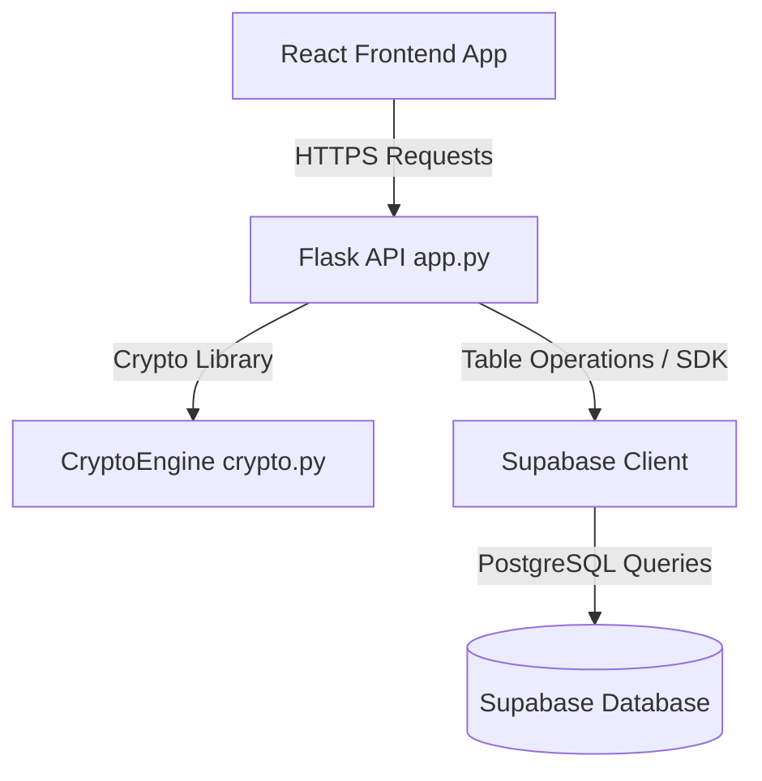
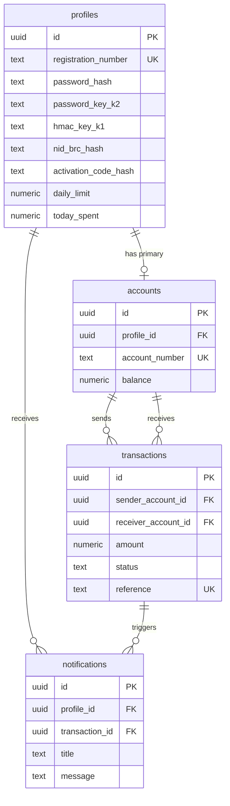

# PROJECT ANALYSIS REPORT: E-Banking Thesis Application

---

## 1. Project Overview

### 1.1 Project Name
*   **Repository Folder Name:** `e_banking`
*   **Vite Package Configuration Name:** `@figma/my-make-file` (as defined in [package.json](file:///E:/Apps/Sohan/E_PAY/e_banking/frontend/package.json))
*   **Web Application Brand:** **e-pay** (rendered in browser title)

### 1.2 Purpose
This application is a mobile-first responsive e-payment thesis prototype based on the research paper **"E-Payment System to Reduce Use of Paper Money for Daily Transactions"** (published at ICECTE 2022). 
The core academic thesis proposed is a **3-factor cryptographic OTP-free authentication scheme** designed to replace traditional mobile banking authentication mechanisms (such as SMS-based OTPs, telecom phone-number verification, or cellular network recovery) with a localized cryptographic contract. 

It guarantees security and prevents replay attacks by binding transactions to:
1.  **Something you have:** A device-specific key ($K1$) derived from hardware data (simulated MAC address).
2.  **Something you know:** A private, stretched user password key ($K2$).
3.  **Something you are:** A hashed biometric fingerprint template ($BP$).
4.  **Rotating context:** A synchronized, rotating UTC timestamp ($T$) that shifts with each successful transaction.

### 1.3 Main Features
*   **Bank-Assisted Onboarding Flow:** Users must visit a physical branch where a bank officer verifies their identity, assigns a unique username, and generates a K1 key bound to their device.
*   **Biometric BP Enrollment:** Simulates a three-scan biometric capture to register a secure cryptographic fingerprint hash.
*   **Stretched K2 Generation:** User establishes their private password, stretched server-side using `PBKDF2-SHA256` with the user's NID/BRC as a salt.
*   **Secure Insecure Channel Transfers:** Performs client-side `AES-256-CBC` encryption of transaction messages using the derived $AES\_Key = \text{HMAC-SHA256}(K2\_stretched, BP\_hash \parallel T)$ and appends a device-bound HMAC seal ($F1$). The server validates the seal ($F1 = F2$) and updates balances.
*   **Replay Attack Mitigation:** Verifies that the incoming transaction timestamp $T$ is within 180 seconds of server time and is strictly greater than the database-tracked $\text{Last\_T}$.
*   **Daily Transaction Limit Tracker:** Restricts petty cash transfers to a maximum of ৳5,000.00 BDT per day, resetting every 24 hours.
*   **Simulated Value-Add Features:** Includes integrations for Email Verification, QR Code Scanning, NFC Tap-to-Pay, Card Linking, and Social Login to show potential extensions.

### 1.4 User Roles
1.  **End-User (Customer/Sender/Receiver):** The primary user who activates their account, logs in using password credentials, checks their balance, reviews history, and executes payments.
2.  **Bank Officer (Branch Operator):** A trusted staff member who initiates registration, verifies identity documents (NID/BRC), registers devices, and provides activation codes.
3.  **Staff Profile (Officer/System Admin):** Database entities (role `'officer'`) representing internal operators.

---

## 2. Technology Stack

### 2.1 Frontend Technologies
*   **Core Framework:** React v18.3.1 (with TypeScript)
*   **Client Router:** React Router v7.13.0
*   **Styling Engine:** Tailwind CSS v4.1.12 (utilizing custom tokens in `frontend/src/styles/theme.css`)
*   **Motion & Transition:** Framer Motion (imported as `motion/react`) v12.23.24
*   **Icon Library:** Lucide React v0.487.0
*   **Build Utility:** Vite v6.3.5
*   **Cryptographic Operations:** `crypto-js` (implements PBKDF2, HMAC-SHA256, and AES-256-CBC)

### 2.2 Backend Technologies
*   **Language Runtime:** Python v3.11+
*   **Server Framework:** Flask (Python Web Server Gateway Interface)
*   **CORS Configuration:** Flask-CORS (allowing cross-origin requests from Vite development servers)
*   **Cryptographic Library:** `pycryptodome` (handles server-side `AES` and padding unpad operations)
*   **Environment Management:** `python-dotenv`
*   **Database Adapter:** `psycopg2` (used for direct PostgreSQL schema connectivity)
*   **Cloud Backend SDK:** `supabase` Python client library (interacts with REST APIs and Auth Admin API)

### 2.3 Database Technologies
*   **Hosting Service:** Supabase Cloud Database (PostgreSQL v15+)
*   **ORM Layer:** Direct SQL queries and Supabase Table API. The backend uses raw client calls (`supabase.table().select().execute()`) which act as a lightweight SDK-based query builder.

### 2.4 Authentication Methods
*   **API Authentication:** Header-based session token (`Authorization: Bearer <session_token>`).
*   **Session Management:** Flask server maintains an in-memory dictionary `active_sessions` mapping session UUID tokens to authenticated usernames.
*   **User Account Database:** Supabase Auth is integrated. Accounts are created with synthetic emails (`username@example.com`) to allow username-based authentication.

### 2.5 External Services & APIs
*   **Supabase Cloud API:** Handles remote storage, auth tables, and notification inserts.
*   **PostgREST REST API:** Used occasionally on the client side (referenced in `utils/database.ts` using direct REST calls with API keys).

### 2.6 Deployment Configuration
*   **Containerization:** `Dockerfile` and `.dockerignore` for deploying a containerized Flask service.
*   **Web Server / Proxy:** Configured to work behind Nginx, mapping paths to `/app.py` with TLS enabled via self-signed keys located in the parent directory (`../nginx/ssl/`).

---

## 3. Folder Structure

### 3.1 Folder Tree
```text
e_banking/
├── app.py                         # Root entry point launcher & TLS wrapper
├── backend/                       # Flask Backend Service
│   ├── .env.backend               # Backend environment secrets
│   ├── app.py                     # Main Flask Application & API endpoints
│   ├── crypto.py                  # PyCryptodome Cryptographic Engine
│   ├── init_database.py           # Auto-migration script for SQL schema
│   ├── requirements.txt           # Python backend dependencies
│   └── supabase_config.py         # Default Supabase configuration parameters
├── database/                      # SQL Database Initialization
│   └── SUPABASE_NEW_DATABASE_SETUP.sql # Full DDL schema setup
├── docs/                          # Project documentation
│   ├── CLONE_AND_RUN.md
│   ├── CODE_REVIEW.md
│   ├── DOCKER_SANDBOX.md
│   ├── PROJECT_STRUCTURE.md
│   └── guide/                     # Detailed guides and thesis papers
│       ├── ATTRIBUTIONS.md
│       ├── FINAL_INTEGRATION_GUIDE.md
│       ├── Guidelines.md
│       ├── INTEGRATION_GUIDE.md
│       ├── PROJECT_COMPLETION_SUMMARY.md
│       ├── QUICKSTART.md
│       ├── QUICKSTARTWHILEFRONTEND.md
│       ├── QUICK_START.md
│       ├── README.md
│       ├── README_FULL.md
│       ├── SCREEN_FLOWS.md
│       ├── SECURITY_WORKFLOW.md
│       └── THESIS_DOCUMENTATION.md
├── frontend/                      # React Frontend Application
│   ├── .env                       # Frontend environment variables
│   ├── index.html                 # HTML Entry Document
│   ├── package.json               # Node Package configuration
│   ├── tsconfig.json              # TypeScript compilation rules
│   ├── vite.config.ts             # Vite configuration
│   └── src/                       # Frontend source files
│       ├── main.tsx               # SPA entry point file
│       ├── app/
│       │   ├── App.tsx            # Main router configuration
│       │   ├── components/        # Custom and UI components
│       │   │   ├── Button.tsx
│       │   │   ├── DailyLimitIndicator.tsx
│       │   │   ├── Input.tsx
│       │   │   ├── ProcessingStep.tsx
│       │   │   ├── SecurityBadge.tsx
│       │   │   ├── TransactionCard.tsx
│       │   │   ├── figma/
│       │   │   │   └── ImageWithFallback.tsx
│       │   │   └── ui/            # Pre-configured shadcn/ui components (unused)
│       │   └── screens/           # Core SPA Pages
│       │       ├── ActivationStart.tsx
│       │       ├── ActivationSuccess.tsx
│       │       ├── AdditionalFeatures.tsx
│       │       ├── BiometricEnrollment.tsx
│       │       ├── CreatePassword.tsx
│       │       ├── Dashboard.tsx
│       │       ├── Login.tsx
│       │       ├── OfficerVerify.tsx
│       │       ├── SendMoney.tsx
│       │       ├── TransactionHistory.tsx
│       │       ├── TransactionProcessing.tsx
│       │       └── TransactionResult.tsx
│       ├── styles/                # CSS Stylesheets
│       │   ├── index.css
│       │   ├── tailwind.css
│       │   └── theme.css
│       └── utils/                 # Frontend Utility Helper modules
│           ├── api.ts             # REST Client calls to Flask backend
│           ├── crypto.ts          # CryptoJS Cryptographic Engine
│           ├── database.ts        # Direct Supabase REST queries (unused)
│           ├── session.ts         # User session localStorage interface
│           └── supabase.ts        # Supabase host endpoints & key references
```

### 3.2 Major Folder Purpose
*   **`backend/`**: Hosts the web server executing security operations. Because cryptographic algorithms must run in a secure execution boundary, the Python server handles validation of HMACs, decrypts request payloads, and resets context timestamps.
*   **`database/`**: Stores database structure definitions. Paste these SQL queries directly into the Supabase database editor.
*   **`docs/`**: Serves as the developer and academic reference repository. It explains mathematical mappings, flow diagrams, and lists issues.
*   **`frontend/`**: Hosts the user interface. It performs client-side encryption of payloads, manages sessions in the browser, and renders step-by-step cryptographic animations.

---

## 4. Frontend Analysis

### 4.1 Pages/Routes
*   `/` : [ActivationStart.tsx](file:///E:/Apps/Sohan/E_PAY/e_banking/frontend/src/app/screens/ActivationStart.tsx)
*   `/officer-verify` : [OfficerVerify.tsx](file:///E:/Apps/Sohan/E_PAY/e_banking/frontend/src/app/screens/OfficerVerify.tsx)
*   `/biometric-enrollment` : [BiometricEnrollment.tsx](file:///E:/Apps/Sohan/E_PAY/e_banking/frontend/src/app/screens/BiometricEnrollment.tsx)
*   `/create-password` : [CreatePassword.tsx](file:///E:/Apps/Sohan/E_PAY/e_banking/frontend/src/app/screens/CreatePassword.tsx)
*   `/activation-success` : [ActivationSuccess.tsx](file:///E:/Apps/Sohan/E_PAY/e_banking/frontend/src/app/screens/ActivationSuccess.tsx)
*   `/login` : [Login.tsx](file:///E:/Apps/Sohan/E_PAY/e_banking/frontend/src/app/screens/Login.tsx)
*   `/dashboard` : [Dashboard.tsx](file:///E:/Apps/Sohan/E_PAY/e_banking/frontend/src/app/screens/Dashboard.tsx)
*   `/send-money` : [SendMoney.tsx](file:///E:/Apps/Sohan/E_PAY/e_banking/frontend/src/app/screens/SendMoney.tsx)
*   `/transaction-processing` : [TransactionProcessing.tsx](file:///E:/Apps/Sohan/E_PAY/e_banking/frontend/src/app/screens/TransactionProcessing.tsx)
*   `/transaction-result` : [TransactionResult.tsx](file:///E:/Apps/Sohan/E_PAY/e_banking/frontend/src/app/screens/TransactionResult.tsx)
*   `/history` : [TransactionHistory.tsx](file:///E:/Apps/Sohan/E_PAY/e_banking/frontend/src/app/screens/TransactionHistory.tsx)
*   `/features` : [AdditionalFeatures.tsx](file:///E:/Apps/Sohan/E_PAY/e_banking/frontend/src/app/screens/AdditionalFeatures.tsx)

### 4.2 Components
*   `Button` (located in [Button.tsx](file:///E:/Apps/Sohan/E_PAY/e_banking/frontend/src/app/components/Button.tsx))
*   `Input` (located in [Input.tsx](file:///E:/Apps/Sohan/E_PAY/e_banking/frontend/src/app/components/Input.tsx))
*   `DailyLimitIndicator` (located in [DailyLimitIndicator.tsx](file:///E:/Apps/Sohan/E_PAY/e_banking/frontend/src/app/components/DailyLimitIndicator.tsx))
*   `ProcessingStep` (located in [ProcessingStep.tsx](file:///E:/Apps/Sohan/E_PAY/e_banking/frontend/src/app/components/ProcessingStep.tsx))
*   `SecurityBadge` (located in [SecurityBadge.tsx](file:///E:/Apps/Sohan/E_PAY/e_banking/frontend/src/app/components/SecurityBadge.tsx))
*   `TransactionCard` (located in [TransactionCard.tsx](file:///E:/Apps/Sohan/E_PAY/e_banking/frontend/src/app/components/TransactionCard.tsx))
*   `ImageWithFallback` (located in [ImageWithFallback.tsx](file:///E:/Apps/Sohan/E_PAY/e_banking/frontend/src/app/components/figma/ImageWithFallback.tsx))

### 4.3 Layouts
There are no shared outer layout wrapper components (e.g., standard `<Layout>` components). Instead, each page manages its own layouts using Tailwind CSS grid/flex structures, sharing common background wrappers:
*   `min-h-screen bg-[#F6FAF9]` for onboarding/auth flows.
*   `min-h-screen bg-background` with a green header panel for in-app page containers.

### 4.4 Forms
*   **Verification Form** (in [OfficerVerify.tsx](file:///E:/Apps/Sohan/E_PAY/e_banking/frontend/src/app/screens/OfficerVerify.tsx)): Collects NID/BRC, Activation Code, and Username.
*   **Password Setup Form** (in [CreatePassword.tsx](file:///E:/Apps/Sohan/E_PAY/e_banking/frontend/src/app/screens/CreatePassword.tsx)): Collects Password and Confirm Password.
*   **Login Form** (in [Login.tsx](file:///E:/Apps/Sohan/E_PAY/e_banking/frontend/src/app/screens/Login.tsx)): Collects Username and Password.
*   **Transfer Form** (in [SendMoney.tsx](file:///E:/Apps/Sohan/E_PAY/e_banking/frontend/src/app/screens/SendMoney.tsx)): Collects Receiver Username and Amount.

### 4.5 Modals
*   **Biometric Fingerprint Scan Overlay** (simulated via an inline HTML overlay in [TransactionProcessing.tsx](file:///E:/Apps/Sohan/E_PAY/e_banking/frontend/src/app/screens/TransactionProcessing.tsx)).

### 4.6 Tables
No raw `<table>` tags are used in the core flow. Instead, lists of details are rendered using stacked Flexbox lists (e.g., inside recent transaction histories).

### 4.7 Buttons
*   Customized `<Button>` components utilizing variants: `'primary'`, `'outline'`, `'danger'`, and sizes `'sm'`, `'md'`, `'lg'`.

### 4.8 Navigation Menus
*   Standard back navigation buttons using Lucide's `<ArrowLeft>` icons.
*   Log Out icon button on the Dashboard.

### 4.9 Dashboards
*   **Customer Dashboard** ([Dashboard.tsx](file:///E:/Apps/Sohan/E_PAY/e_banking/frontend/src/app/screens/Dashboard.tsx)): Contains balance displays, quick actions, daily spend meters, and list of transactions.

### 4.10 User Interactions
*   Clicking **"I have an activation code"** triggers registration.
*   Real-time **username validation queries** on the receiver search box.
*   Placing the **fingerprint** on the scanning modal to start encryption.
*   Flipping accordions to expand simulated utility features.

---

## 5. Page-by-Page Analysis

### 5.1 ActivationStart
*   **Route URL:** `/`
*   **Page Name:** Activation Start
*   **Purpose:** Initial welcome screen explaining the thesis prototype's security parameters.
*   **Visible Content:** Shield icons, checklist of onboarding steps (Officer verification, K1 generation, Private K2), introductory text.
*   **Buttons:** `"I have an activation code"` (navigates to `/officer-verify`), `"Already registered"` (navigates to `/login`).
*   **Forms / Tables / Cards / Filters / Search bars:** None.
*   **Actions:** Navigates to target routes on click.
*   **API Calls:** None.
*   **State Management:** None.
*   **Validation Rules:** None.

### 5.2 OfficerVerify
*   **Route URL:** `/officer-verify`
*   **Page Name:** Bank Officer Verification
*   **Purpose:** Verification of customer parameters issued at the physical bank branch.
*   **Visible Content:** Information sidecards, instruction boxes, inputs.
*   **Buttons:** `"Back"`, `"Continue to BP and K2"` (submits form).
*   **Forms:** Form gathering NID, Activation Code, and Username.
*   **Tables / Cards / Filters / Search bars:** None.
*   **Actions:** Transports collected inputs to the next route state.
*   **API Calls:** None.
*   **State Management:** Local React `useState` for `formData`.
*   **Validation Rules:** All fields are marked as `required`.

### 5.3 BiometricEnrollment
*   **Route URL:** `/biometric-enrollment`
*   **Page Name:** Biometric Fingerprint
*   **Purpose:** Simulated setup of biometric fingerprint keys.
*   **Visible Content:** Fingerprint scanning icon, mono display showing fingerprint code `123456`.
*   **Buttons:** `"Continue"`, `"Back"`.
*   **Forms / Tables / Cards / Filters / Search bars:** None.
*   **Actions:** Passes state parameters to password setup.
*   **API Calls:** None.
*   **State Management:** Ingests React Router `location.state` context.
*   **Validation Rules:** None.

### 5.4 CreatePassword
*   **Route URL:** `/create-password`
*   **Page Name:** Create Private K2
*   **Purpose:** User establishes their private password K2.
*   **Visible Content:** Side panel highlighting key security architecture, input fields, password strength indicator bar.
*   **Buttons:** `"Activate Account"`.
*   **Forms:** Password inputs.
*   **Tables / Filters / Search bars:** None.
*   **Cards:** Warning panels (bank cannot recover password, database creation notice).
*   **Actions:** Submits registration parameters to the backend.
*   **API Calls:** Calls `registerAccount()` (POST to `/register` endpoint).
*   **State Management:** Local React `useState` for `formData`, `error`, and `isLoading`.
*   **Validation Rules:** Password length must be $\ge 8$ characters. Confirm password must match password.

### 5.5 ActivationSuccess
*   **Route URL:** `/activation-success`
*   **Page Name:** Account Activated
*   **Purpose:** Confirmation screen showing setup details.
*   **Visible Content:** Success checkmark animation, lists of enabled security features, daily limit indicator card.
*   **Buttons:** `"Go to Login"`.
*   **Forms / Tables / Cards / Filters / Search bars / Actions / API Calls / State Management / Validation Rules:** None.

### 5.6 Login
*   **Route URL:** `/login`
*   **Page Name:** Account Login
*   **Purpose:** Authenticate the user to retrieve their session key.
*   **Visible Content:** Login layout box, alert error panels.
*   **Buttons:** `"Login"`, `"Activate new account"`, `"Forgot K2?"`.
*   **Forms:** Inputs for Bank Username and Password.
*   **Tables / Cards / Filters / Search bars:** None.
*   **Actions:** Invokes authentication and routes to dashboard on success.
*   **API Calls:** Calls `loginUser()` (POST to `/login` endpoint).
*   **State Management:** Local React `useState` for credentials and error states.
*   **Validation Rules:** All fields are `required`.

### 5.7 Dashboard
*   **Route URL:** `/dashboard`
*   **Page Name:** Dashboard
*   **Purpose:** The central workspace interface for in-app activities.
*   **Visible Content:** Welcome headers, active user profile details, balance display, limit bar meter, quick action buttons, recent transaction list.
*   **Buttons:** `"View All"`, Logout button, History icon, Quick Action category icons.
*   **Forms / Tables / Filters / Search bars:** None.
*   **Cards:** Quick action items, limit progress bars, recent transactions, features promotion link.
*   **Actions:** Clicking on actions navigates to transfer panels. Log out clears sessions.
*   **API Calls:** Calls `getTransactionHistory()` (GET to `/transactions/<username>` endpoint).
*   **State Management:** Ingests context variables from `getUserSession()`. Local `useState` holds `recentTransactions`.
*   **Validation Rules:** Redirects to `/login` if session is absent.

### 5.8 SendMoney
*   **Route URL:** `/send-money`
*   **Page Name:** Send Money
*   **Purpose:** Initiating transactions.
*   **Visible Content:** Green action banner, input fields, dynamic receiver lookup notifications.
*   **Buttons:** `"Proceed"`, Back button.
*   **Forms:** Receiver Username and Amount inputs.
*   **Tables / Filters / Search bars:** None.
*   **Cards:** Transfer guidelines side-card.
*   **Actions:** Real-time receiver validation while typing.
*   **API Calls:** Calls `checkReceiver()` (GET to `/check-receiver/<username>`).
*   **State Management:** `useState` tracks `formData`, `receiverFound` status, and `searchingReceiver`.
*   **Validation Rules:** Receiver must exist in the database. Transfer amount must be $\ge 1$ and cannot exceed the remaining daily limit ($5000 - \text{spent}$).

### 5.9 TransactionProcessing
*   **Route URL:** `/transaction-processing`
*   **Page Name:** Transaction Processing
*   **Purpose:** Encrypts data client-side and transmits it.
*   **Visible Content:** Core processing loading loop, details box showing target recipient, amount, and timestamp ($T$), step-by-step processing animations.
*   **Buttons:** None.
*   **Forms / Tables / Cards / Filters / Search bars:** None.
*   **Actions:** Sequentially executes cryptographic routines, calls backend API, and routes to results.
*   **API Calls:** Calls `processTransfer()` (POST to `/transfer` endpoint).
*   **State Management:** Local state stores `currentStep` (0 = HMAC, 1 = AES, 2 = Send), `timestamp`, and `transactionStatus`.
*   **Validation Rules:** Rejects processing and routes to result failure screen if keys $K1$, $K2$, or $T$ are missing from the browser session.

### 5.10 TransactionResult
*   **Route URL:** `/transaction-result`
*   **Page Name:** Transaction Result
*   **Purpose:** Server verification outcome screen.
*   **Visible Content:** Success/error illustrations, transaction breakdown cards, security confirmation boxes.
*   **Buttons:** `"Back to Home"`, `"View Transaction History"`.
*   **Forms / Tables / Cards / Filters / Search bars / Actions / API Calls / State / Validation Rules:** None.

### 5.11 TransactionHistory
*   **Route URL:** `/history`
*   **Page Name:** Transaction History
*   **Purpose:** Lists historical transactions.
*   **Visible Content:** Green top banner, filter selection bars, lists of transactions.
*   **Buttons:** Back button, Tab filters.
*   **Forms / Tables / Cards / Search bars:** None.
*   **Filters:** Tab buttons: `[All]`, `[Successful]`, `[Rejected]`.
*   **Actions:** Tab switching dynamically filters list.
*   **API Calls:** Calls `getTransactionHistory()` (GET to `/transactions/<username>` endpoint).
*   **State Management:** Local `useState` holds `allTransactions`, `activeTab` selection, and `loading`.
*   **Validation Rules:** None.

### 5.12 AdditionalFeatures
*   **Route URL:** `/features`
*   **Page Name:** Additional Features
*   **Purpose:** Demonstrates supplementary features.
*   **Visible Content:** Accordion elements.
*   **Buttons:** Back button, simulation triggers.
*   **Forms:** Email input.
*   **Tables / Cards / Filters / Search bars:** None.
*   **Actions:** Interactive simulator triggers (alerts and timers simulating camera scanner, NFC proximity wave, Google/Facebook login, card details insertion).
*   **API Calls:** None.
*   **State Management:** Local `useState` variables for inputs and scanning timers.
*   **Validation Rules:** Basic format requirements (e.g. card number must be 4 digits).

---

## 6. Component Analysis

### 6.1 Custom UI Components

| Component Name | File Location | Props | Functions | Dependencies | Used By |
| :--- | :--- | :--- | :--- | :--- | :--- |
| **`Button`** | [Button.tsx](file:///E:/Apps/Sohan/E_PAY/e_banking/frontend/src/app/components/Button.tsx) | `children`: ReactNode<br>`variant`?: 'primary' \| 'secondary' \| 'outline' \| 'danger'<br>`size`?: 'sm' \| 'md' \| 'lg'<br>`fullWidth`?: boolean<br>`className`?: string | Standard HTML button wrapper. | React | Used globally across all screens. |
| **`Input`** | [Input.tsx](file:///E:/Apps/Sohan/E_PAY/e_banking/frontend/src/app/components/Input.tsx) | `label`?: string<br>`error`?: string<br>`helperText`?: string<br>`isPassword`?: boolean<br>`showK2Label`?: boolean | Toggle password text visibility using state hooks. | React, Lucide React (`Eye`, `EyeOff`) | Used on forms inside `OfficerVerify`, `CreatePassword`, `Login`, `SendMoney`, and `AdditionalFeatures`. |
| **`DailyLimitIndicator`** | [DailyLimitIndicator.tsx](file:///E:/Apps/Sohan/E_PAY/e_banking/frontend/src/app/components/DailyLimitIndicator.tsx) | `spent`: number<br>`limit`: number<br>`showDetails`?: boolean | `getColor()`: Changes indicator bar colors based on limits used (green $\le 70\%$, yellow $\le 90\%$, red otherwise). | React, Lucide React (`TrendingDown`) | Used on `Dashboard`. |
| **`ProcessingStep`** | [ProcessingStep.tsx](file:///E:/Apps/Sohan/E_PAY/e_banking/frontend/src/app/components/ProcessingStep.tsx) | `currentStep`: number<br>`timestamp`?: string | Renders key transaction milestones (generating HMAC, AES encryption, data transmission) based on current step indices. | React, Lucide React (`Hash`, `Lock`, `Send`, `Check`), Motion (`motion/react`) | Used on `TransactionProcessing`. |
| **`SecurityBadge`** | [SecurityBadge.tsx](file:///E:/Apps/Sohan/E_PAY/e_banking/frontend/src/app/components/SecurityBadge.tsx) | `type`: 'device-verified' \| 'hmac-verified' \| 'aes-secured' \| 'integrity-check'<br>`className`?: string | Maps badge strings to specific color sets and icon graphics. | React, Lucide React (`Shield`, `CheckCircle`, `Lock`, `Hash`) | Used on `Dashboard`, `TransactionResult`, and `TransactionCard`. |
| **`TransactionCard`** | [TransactionCard.tsx](file:///E:/Apps/Sohan/E_PAY/e_banking/frontend/src/app/components/TransactionCard.tsx) | `receiverUsername`: string<br>`amount`: number<br>`timestamp`: string<br>`status`: 'success' \| 'rejected' \| 'pending'<br>`showSecurityBadge`?: boolean<br>`type`?: 'sent' \| 'received' | Renders transactional ledger items showing status and security badge overlays. | React, Lucide React (`ArrowUpRight`, `CheckCircle`, `XCircle`, `Clock`), `SecurityBadge` | Used on `Dashboard` and `TransactionHistory`. |
| **`ImageWithFallback`** | [ImageWithFallback.tsx](file:///E:/Apps/Sohan/E_PAY/e_banking/frontend/src/app/components/figma/ImageWithFallback.tsx) | `React.ImgHTMLAttributes<HTMLImageElement>` | `handleError()`: Swaps broken source URLs with base64 error templates. | React | Not active in core page paths (part of imported Figma layouts). |

---

## 7. Backend Analysis

### 7.1 Architecture Overview
The backend is a **Flask REST API Service**. It is configured to run as a single-instance backend server communicating with **Supabase Database** services over SQL and authenticated REST connections. The backend handles database transactions, cryptographic validation, and JWT session handling.



### 7.2 Core Endpoints (Controllers)
API routing endpoints are configured directly in [backend/app.py](file:///E:/Apps/Sohan/E_PAY/e_banking/backend/app.py). There is no separate Controller folder structure; all logic is defined inline within route declarations.

### 7.3 Middleware
*   **`require_auth` Decorator:** Implements middleware-based API protection. It checks the request headers for an `Authorization` field (`Bearer <token>`). If the token is not present or does not exist in the in-memory `active_sessions` dictionary, it aborts the request and returns a `401 Unauthorized` response.

### 7.4 Authentication Flow
*   **POST `/login`:** Authenticates the user by verification of password hashes. If valid, the backend creates a session token (via `uuid.uuid4()`), maps the token to the username inside the `active_sessions` dictionary, logs a success event, and returns profile credentials (including keys $K1$ and $K2$) to the frontend.

### 7.5 Authorization Flow
*   **Path Parameter Checks:** Most endpoints expect a `<username>` parameter. The backend queries Supabase profiles using this username. *Note: An IDOR vulnerability exists here where the token verified in middleware is not validated against the path username.*

### 7.6 Validation Logic
*   **JSON Content Verification:** Requests to `/login`, `/register`, and `/transfer` verify that required JSON payload parameters exist.
*   **Balance Validation:** Checks sender balance against amount before committing transfers.
*   **Replay Attack Check:** Verifies that request timestamp $T$ falls within a 180-second window of server time and is strictly greater than the database-stored `Last_T` parameter.

### 7.7 Error Handling
*   **Database Schema Error Checks:** `is_missing_schema_error` checks database SQL error codes (e.g. `PGRST205`, cache exceptions). If tables are missing, it returns a descriptive recovery response.
*   **General Exception Catches:** Encased inside `try/except` blocks, returning standard `500 Internal Server Error` response packages.

---

## 8. API Documentation

### 8.1 GET `/health`
*   **Purpose:** Simple endpoint to verify the backend is running.
*   **Request Body:** None.
*   **Response Body:**
    ```json
    {
      "status": "ok",
      "message": "E-Banking API is running"
    }
    ```
*   **Auth Required:** No.
*   **Validation Rules:** None.

### 8.2 POST `/login`
*   **Purpose:** Validates credentials and yields keys.
*   **Request Body:**
    ```json
    {
      "username": "sohan",
      "password": "userpass"
    }
    ```
*   **Response Body (Success):**
    ```json
    {
      "status": "success",
      "token": "d748f322-17cb-4b77-a8b4-b4a02d4491c3",
      "user": {
        "id": "e44c21a3-4889-4eb1-b0db-529a39ad91bf",
        "username": "sohan",
        "k1": "K1_key_hex_value",
        "k2": "K2_stretched_key_hex_value",
        "bp": "123456",
        "t": "2026-06-12T10:00:00Z",
        "balance": 5000.0,
        "accountId": "a32c441b-...",
        "daily_limit": 5000.0,
        "today_spent": 0.0
      }
    }
    ```
*   **Auth Required:** No.
*   **Validation Rules:** Both `username` and `password` parameters must be present.

### 8.3 POST `/register`
*   **Purpose:** Inserts new customer credentials, auth tables, and accounts.
*   **Request Body:**
    ```json
    {
      "username": "sohan",
      "password": "userpass",
      "nid": "1990123456789",
      "activationCode": "ACT-1234",
      "bp": "123456"
    }
    ```
*   **Response Body:**
    ```json
    {
      "status": "success",
      "message": "Account created successfully"
    }
    ```
*   **Auth Required:** No.
*   **Validation Rules:** `username`, `password`, `nid`/`brc`, and `activationCode`/`activation_code` must be provided. Username must be unique. Password must be at least 8 characters.

### 8.4 GET `/user/<username>`
*   **Purpose:** Fetch account profile details.
*   **Request Body:** None.
*   **Response Body:**
    ```json
    {
      "status": "success",
      "user": {
        "id": "user-uuid",
        "username": "sohan",
        "balance": 4900.00,
        "daily_limit": 5000.00,
        "today_spent": 100.00
      }
    }
    ```
*   **Auth Required:** Yes.
*   **Validation Rules:** Bearer token must be valid.

### 8.5 GET `/transactions/<username>`
*   **Purpose:** Retrieve historical transactions.
*   **Request Body:** None.
*   **Response Body:**
    ```json
    {
      "status": "success",
      "transactions": [
        {
          "id": "txn-uuid",
          "amount": 100.0,
          "status": "success",
          "created_at": "2026-06-12T10:05:00Z",
          "reference": "TXN-2026-06-12...",
          "receiver_username": "bob",
          "type": "sent"
        }
      ]
    }
    ```
*   **Auth Required:** Yes.
*   **Validation Rules:** Bearer token must be valid.

### 8.6 GET `/notifications/<username>`
*   **Purpose:** Returns user activity alerts.
*   **Request Body:** None.
*   **Response Body:**
    ```json
    {
      "status": "success",
      "notifications": [
        {
          "id": "notif-uuid",
          "profile_id": "user-uuid",
          "title": "Transfer successful",
          "message": "BDT 100.00 sent to bob.",
          "notification_type": "transfer_success",
          "created_at": "2026-06-12T10:05:01Z"
        }
      ]
    }
    ```
*   **Auth Required:** Yes.

### 8.7 GET `/check-receiver/<username>`
*   **Purpose:** Dynamic validation to verify if recipient username is registered.
*   **Request Body:** None.
*   **Response Body (Success):**
    ```json
    {
      "status": "success",
      "username": "sohan"
    }
    ```
*   **Auth Required:** Yes.

### 8.8 POST `/transfer`
*   **Purpose:** Decrypts, verifies, and executes transaction requests.
*   **Request Body:**
    ```json
    {
      "username": "sohan",
      "payload": "base64_ciphertext_payload",
      "iv": "base64_initialization_vector"
    }
    ```
*   **Response Body (Success):**
    ```json
    {
      "status": "success",
      "message": "Transfer of 100.0 to bob successful",
      "new_t": "2026-06-12T10:05:00.000000+00:00",
      "new_balance": 4900.00
    }
    ```
*   **Response Body (Futile):**
    ```json
    {
      "status": "futile",
      "message": "Insufficient balance"
    }
    ```
*   **Auth Required:** Yes.
*   **Validation Rules:** Payload, username, and IV must be present. Decryption must succeed. HMAC signature check must pass. Sender balance must cover the transfer amount.

---

## 9. Database Analysis

### 9.1 Database Type
*   **Type:** PostgreSQL (hosted on Supabase Cloud)

### 9.2 Connection Configuration
*   **API Client Access:** Uses the Supabase Python Client SDK (`create_client`) configured with the Supabase Project URL and Key.
*   **Database Migration Connection:** Uses `psycopg2` direct database connection parameters configured in `.env.backend`:
    *   `db.<project_ref>.supabase.co:5432`

### 9.3 ORM Used
*   None. Operates directly on SQL schemas using PostgreSQL operations and Supabase RESTful endpoints.

### 9.4 Tables, Relationships & Keys



---

## 10. Database Schema

Detailed schema mappings extracted directly from [database/SUPABASE_NEW_DATABASE_SETUP.sql](file:///E:/Apps/Sohan/E_PAY/e_banking/database/SUPABASE_NEW_DATABASE_SETUP.sql):

### 10.1 Table: `profiles`
*   Stores core user attributes and cryptographic keys.
*   **Row-Level Security (RLS):** Enabled.

| Column | Data Type | Nullable? | Default Value | Constraints / Relationships |
| :--- | :--- | :--- | :--- | :--- |
| `id` | `uuid` | NO | None | Primary Key, References `auth.users(id)` ON DELETE CASCADE |
| `registration_number`| `text` | NO | None | Unique constraint (acts as Bank Username) |
| `password_hash` | `text` | NO | None | Password hash for login authentication |
| `password_key_k2` | `text` | NO | None | Stretched password key ($K2$) |
| `hmac_key_k1` | `text` | NO | None | Device HMAC secret ($K1$) |
| `fingerprint_bp` | `text` | NO | `'123456'` | Biometric fingerprint hash ($BP$) |
| `timestamp_t` | `timestamptz` | NO | `now()` | Last successful transaction timestamp ($T$) |
| `nid_brc_hash` | `text` | NO | None | HMAC hash of NID/BRC |
| `activation_code_hash`| `text` | NO | None | HMAC hash of Activation Code |
| `daily_limit` | `numeric(14,2)`| NO | `5000.00` | Must be non-negative |
| `today_spent` | `numeric(14,2)`| NO | `0.00` | Must be non-negative |
| `last_spend_reset_date`| `date` | NO | `current_date`| Reset tracker |
| `full_name` | `text` | YES | None | Optional |
| `phone_number` | `text` | YES | None | Optional |
| `email` | `text` | YES | None | Optional |
| `status` | `account_status`| NO | `'active'` | ENUM: `'active'`, `'frozen'`, `'closed'` |
| `created_at` | `timestamptz` | NO | `now()` | Audit |
| `updated_at` | `timestamptz` | NO | `now()` | Audit |

### 10.2 Table: `accounts`
*   Manages ledger balances.
*   **RLS:** Enabled.

| Column | Data Type | Nullable? | Default Value | Constraints / Relationships |
| :--- | :--- | :--- | :--- | :--- |
| `id` | `uuid` | NO | `gen_random_uuid()` | Primary Key |
| `profile_id` | `uuid` | NO | None | Foreign Key referencing `profiles(id)` ON DELETE CASCADE |
| `account_number` | `text` | NO | None | Unique constraint |
| `account_type` | `account_type` | NO | `'personal'` | ENUM: `'personal'`, `'merchant'`, `'biller'`, `'staff'` |
| `balance` | `numeric(14,2)`| NO | `5000.00` | Balance check non-negative |
| `currency` | `text` | NO | `'BDT'` | Standard currency code |
| `is_active` | `boolean` | NO | `true` | Status |
| `created_at` | `timestamptz` | NO | `now()` | Audit |
| `updated_at` | `timestamptz` | NO | `now()` | Audit |

### 10.3 Table: `transactions`
*   Main transaction ledger.
*   **RLS:** Enabled.

| Column | Data Type | Nullable? | Default Value | Constraints / Relationships |
| :--- | :--- | :--- | :--- | :--- |
| `id` | `uuid` | NO | `gen_random_uuid()` | Primary Key |
| `sender_account_id` | `uuid` | YES | None | Foreign Key referencing `accounts(id)` ON DELETE SET NULL |
| `receiver_account_id`| `uuid` | YES | None | Foreign Key referencing `accounts(id)` ON DELETE SET NULL |
| `merchant_id` | `uuid` | YES | None | Foreign Key referencing `merchants_or_billers(id)` |
| `amount` | `numeric(14,2)`| NO | None | Amount check positive |
| `currency` | `text` | NO | `'BDT'` | Standard currency code |
| `status` | `transaction_status`| NO | None | ENUM: `'pending'`, `'success'`, `'futile'`, `'aborted'`, `'reversed'` |
| `channel` | `transaction_channel`| NO | `'user_transfer'` | ENUM: `'user_transfer'`, `'merchant_payment'`, etc. |
| `failure_reason` | `text` | YES | None | Rejection context details |
| `reference` | `text` | NO | None | Unique transaction reference string |
| `message_m` | `text` | YES | None | Decrypted message string ($M$) |
| `hmac_f1` | `text` | YES | None | Client-generated HMAC signature ($F1$) |
| `hmac_f2` | `text` | YES | None | Server-generated HMAC signature ($F2$) |
| `previous_timestamp_t`| `timestamptz` | YES | None | Previous security timestamp |
| `new_timestamp_t` | `timestamptz` | YES | None | Updated security timestamp |
| `created_at` | `timestamptz` | NO | `now()` | Ledger timestamp |

### 10.4 Other Auxiliary Tables
*   **`registered_devices`**: Tracks MAC address hashes and fingerprints bound to user profiles.
*   **`merchants_or_billers`**: Holds directory codes and categories for utility billing (e.g., DESCO) or merchants.
*   **`beneficiaries`**: Links owner profiles to transaction favorites.
*   **`transaction_crypto_audit`**: Cryptographic audit trail logging payload/IV digests and verification outcomes.
*   **`payment_requests`**: Handles merchant payment requests.
*   **`notifications`**: Stores system and transaction alerts (ENUM: `'registration'`, `'login'`, `'transfer_success'`, etc.).
*   **`login_events`**: Tracks successful and failed authentication attempts.
*   **`staff_profiles`**: Tracks internal bank officers (role: `'officer'`).
*   **`audit_logs`**: Logs administrative database operations.

---

## 11. Authentication & Security

### 11.1 Registration Flow (Bank-Assisted Activation)
1.  **Identity Verification:** The customer provides their NID/BRC to the bank officer.
2.  **Activation Code Generation:** The officer provides a one-time activation code.
3.  **K1 Key Derivation:** The device derives K1 locally:
    $$K1 = \text{HMAC-SHA256}(\text{Activation\_Code} \parallel \text{NID}, \text{MAC\_Address} \parallel \text{BP\_hash})$$
4.  **K2 Password Stretching:** The user inputs their password, which is stretched using PBKDF2-SHA256:
    $$K2 = \text{PBKDF2}(\text{password}, \text{NID}, \text{iterations}=100000)$$
5.  **User Creation:** The backend registers a Supabase Auth user and saves the credentials (including $K1$, $K2$, and $BP$) into the `profiles` table.

```
[Customer NID/BRC] + [Activation Code] + [MAC Address]
                    │
                    ▼
          K1 Key Derivation (HMAC)
                    │
                    ▼
          K2 Password Stretching (PBKDF2)
                    │
                    ▼
  [Supabase Auth User] + [Profile & Account Creation]
```

### 11.2 Login Flow
1.  **Credential Submission:** The user submits their bank-assigned username and password.
2.  **Verification:** The Flask backend verifies the password using `check_password_hash`.
3.  **Session Token Issuance:** The server generates a UUID session token, registers it in `active_sessions`, and returns the user's profile and keys ($K1$, $K2$, $BP$, and $T$) to the client.

### 11.3 Protected Routes
Any API request to `/user/<username>`, `/transactions/<username>`, `/notifications/<username>`, or `/transfer` is intercepted by the `@require_auth` decorator, verifying the Bearer token against `active_sessions`.

### 11.4 Role-Based Access Control (RBAC)
The database structure supports role-based checks (such as `staff_profiles` with role `'officer'`), though the API endpoints currently use basic user authentication.

---

## 12. Business Logic & Cryptographic Workflows

### 12.1 Mathematical Formulas & Verification

The core transaction protocol consists of three stages:

#### 1. Key Derivation (Client-Side)
The user enters their password and biometric fingerprint scan (fixed to `'123456'`). The client derives the temporary AES encryption key:
$$AES\_Key = \text{HMAC-SHA256}(K2\_stretched, \text{BP\_hash} \parallel T)$$
*Where $T$ is the current timestamp from the user's session profile.*

#### 2. Message Generation & Encryption (Client-Side)
The client prepares the transaction message $M$ and computes the signature $F1$:
$$M = \text{"Receiver:Bob|Amt:100.00"}$$
$$F1 = \text{HMAC-SHA256}(K1, M)$$
The client concatenates $M$ and $F1$, then encrypts the payload using AES-256-CBC:
$$\text{Payload} = M \parallel F1$$
$$\text{Encrypted\_Payload} = \text{AES-256-CBC}(AES\_Key, IV, \text{Payload})$$
The client sends `Encrypted_Payload` and `IV` to the server.

#### 3. Verification & Execution (Server-Side)
Upon receiving the payload:
1.  **Replay Check:** Verifies that $|T_{server} - T_{received}| \le 180 \text{s}$ and $T_{received} > \text{Last\_T}$.
2.  **Decryption:** Reconstructs the AES key using the database-stored $K2$, $BP$, and session $T$. Decrypts the payload to extract $M$ and $F1$.
3.  **Integrity Check:** Recomputes $F2$:
    $$F2 = \text{HMAC-SHA256}(K1_{stored}, M)$$
    If $F1 \neq F2$, the request is rejected as tampered.
4.  **Execution:** Verifies the recipient exists, validates the sender's balance, updates account balances, rotates the session timestamp $T$, and returns the success status.

```
       CLIENT                                          SERVER
─────────────────────────────────               ─────────────────────────────────
1. Input Password & BP
2. Derive AES Key
3. Generate F1 = HMAC(K1, M)
4. Encrypt M || F1
5. Send Payload, IV, T  ─────────── [Network] ───────────► 6. Replay Check (T > Last_T)
                                                           7. Reconstruct AES Key
                                                           8. Decrypt M and F1
                                                           9. Verify F1 == F2
                                                          10. Commit & Rotate T
```

---

## 13. Environment Configuration

### 13.1 Backend Environment Configuration (`backend/.env.backend`)
*   **`SUPABASE_URL`**: Target URL of the hosted Supabase instance.
*   **`SUPABASE_KEY`**: Public anonymous API key.
*   **`SUPABASE_SERVICE_ROLE_KEY`**: Supabase administrative service role key (required to bypass Row-Level Security during user creation).
*   **`SUPABASE_DB_PASSWORD`**: Postgres database password.
*   **`SUPABASE_DB_HOST`**: PostgreSQL connection host address.
*   **`SUPABASE_DB_PORT`**: PostgreSQL connection port (default `5432`).
*   **`SUPABASE_DB_USER`**: PostgreSQL user (default `postgres`).

### 13.2 Frontend Environment Configuration (`frontend/.env`)
*   **`VITE_BACKEND_URL`**: Connection endpoint URL pointing to the Flask API (typically `http://localhost:5001`).

---

## 14. Missing Items, Code Debt & Security Concerns

During the review of the database schema, Flask endpoints, and React client files, several security vulnerabilities, bugs, and instances of code debt were identified:

### 14.1 Security Vulnerabilities & Theoretical Mismatches
1.  **Insecure Direct Object Reference (IDOR):** 
    *   **Vulnerability:** The endpoints `/user/<username>`, `/transactions/<username>`, and `/notifications/<username>` require token validation via `@require_auth`. However, the server only checks if the token is valid, **not if the token owner matches the username in the request path**. Any authenticated user can access any other user's profile, balance, transaction history, and system notifications.
2.  **Key Exposure (Cryptographic Principle Violation):** 
    *   **Vulnerability:** In the thesis model, keys $K1$, $K2$, and $BP$ should remain isolated within their respective security boundaries. However, the backend `/login` endpoint returns these keys in plain JSON to the browser, which stores them in `localStorage`. This makes the entire cryptographic scheme vulnerable to theft via Cross-Site Scripting (XSS) attacks.
3.  **Password-based AES Key Derivation:** 
    *   **Weakness:** The AES key is derived directly from the user's password. The strength of the encryption is therefore limited by the complexity of the user-chosen password, making it vulnerable to dictionary attacks.

### 14.2 Code Bugs & Implementation Debt
1.  **Stale Balance Calculation:**
    *   **Bug:** In [TransactionProcessing.tsx](file:///E:/Apps/Sohan/E_PAY/e_banking/frontend/src/app/screens/TransactionProcessing.tsx#L89), the client calculates the new balance locally (`session.balance - amount`) rather than using the `new_balance` returned by the server. This introduces a risk of stale data if other transactions occurred in the background.
2.  **Strict Timestamp Check on Success Navigation:**
    *   **Bug:** In [TransactionProcessing.tsx](file:///E:/Apps/Sohan/E_PAY/e_banking/frontend/src/app/screens/TransactionProcessing.tsx#L87), the navigation to the success screen requires both `status === 'success'` and the presence of `new_t`. If `new_t` is missing (due to a partial server issue), the client shows a "Transaction Failed" error, even though the money was transferred and database was updated.
3.  **Unhandled Database Update Failures:**
    *   **Bug:** In [backend/app.py](file:///E:/Apps/Sohan/E_PAY/e_banking/backend/app.py#L365-L368), the return values of `update_profile_timestamp` and `update_daily_spend` are ignored. If these database updates fail (e.g. database timeout), the server still returns success and the new timestamp to the client. This results in a timestamp mismatch between client and server, locking the user out of future transactions until they log in again.
4.  **TransactionCard Component Parameter Mismatch:**
    *   **Debt:** [TransactionCard.tsx](file:///E:/Apps/Sohan/E_PAY/e_banking/frontend/src/app/components/TransactionCard.tsx) does not accept `type` or `senderUsername` props, but both `Dashboard.tsx` and `TransactionHistory.tsx` pass these parameters. As a result, all transactions in the UI are formatted as sent payments (`-৳` symbol with receiver name), even for received transfers.
5.  **Simulated UI Redirect Labels:**
    *   **UX issue:** Clicking "Utilities" or "Market" on the dashboard redirects the user to the generic "Send Money" screen, and the header title remains "Send Money" rather than reflecting the chosen action.
6.  **Catch-all Route Behavior for Malicious Payloads:**
    *   **Bug:** Sending XSS or path traversal payloads to the `/check-receiver/` endpoint triggers the Flask SPA catch-all route, returning a `200 OK` HTML page (the React index.html) instead of a `400 Bad Request` or `404 Not Found`.

### 14.3 Dead Code & Cleanliness Debt
1.  **Unused Database Utility File:**
    *   **Debt:** The client-side database helper [database.ts](file:///E:/Apps/Sohan/E_PAY/e_banking/frontend/src/utils/database.ts) query helpers are not imported anywhere in the active React screens. All database operations are handled by the Flask API.
2.  **Unused UI Components:**
    *   **Debt:** Over 40 pre-configured shadcn/ui components in `frontend/src/app/components/ui/` are unused, bloating the project bundle size.
3.  **Mismatched Project Naming:**
    *   **Debt:** The package name is configured as `@figma/my-make-file` in `package.json`, the HTML title is "e-pay", and the root directory is named `e_banking`.
4.  **Committed Python Cache Files:**
    *   **Debt:** Compiled bytecode files (`.pyc`) inside `__pycache__` directories were committed to the repository, violating version control best practices.
5.  **No Offline Transaction Queueing:**
    *   **Feature Gap:** The application lacks offline support. Any network disruption during transaction processing results in immediate failure instead of queueing the request for synchronization when connectivity is restored.

---

## 15. Development Guide

### 15.1 System Requirements
Ensure you have the following installed:
*   Python 3.11+
*   Node.js 18+ (with npm)
*   Supabase Account & Project

### 15.2 Database Setup
1.  Log in to the **Supabase Dashboard** and create a new project.
2.  Go to the **SQL Editor** tab.
3.  Copy the contents of [database/SUPABASE_NEW_DATABASE_SETUP.sql](file:///E:/Apps/Sohan/E_PAY/e_banking/database/SUPABASE_NEW_DATABASE_SETUP.sql).
4.  Paste the SQL into the editor and click **Run**.

### 15.3 Environment Configuration
1.  Configure the backend environment:
    *   Open [backend/.env.backend](file:///E:/Apps/Sohan/E_PAY/e_banking/backend/.env.backend) and set the Supabase URL and keys:
        ```env
        SUPABASE_URL=https://<your-project-id>.supabase.co
        SUPABASE_KEY=<your-anon-key>
        SUPABASE_SERVICE_ROLE_KEY=<your-service-role-key>
        ```
2.  Configure the frontend environment:
    *   Open [frontend/.env](file:///E:/Apps/Sohan/E_PAY/e_banking/frontend/.env) and set the API backend URL:
        ```env
        VITE_BACKEND_URL=http://localhost:5001
        ```

### 15.4 Running the Application (Local Development)

#### Step 1: Install Backend Dependencies & Start Server
Open a terminal and run:
```powershell
cd backend
python -m pip install -r requirements.txt
python app.py
```
*The server will start on port 5001.*

#### Step 2: Install Frontend Dependencies & Start Dev Server
Open a second terminal and run:
```powershell
cd frontend
npm install
npm run dev
```
*The Vite development server will start at `http://localhost:5173`.*

### 15.5 Build and Production Deployment
To build the frontend bundle and run the unified Flask application:
1.  Build the frontend static assets:
    ```powershell
    cd frontend
    npm run build
    ```
2.  Start the unified server from the root directory:
    ```powershell
    cd ..
    python app.py
    ```
    *The server builds any missing frontend assets, serves the static build files, and listens on port 5001.*

---

## 16. Final Summary

### 16.1 Feature Summary
*   **Onboarding:** Onboarding flow using bank-issued parameters, K1 key derivation, BP enrollment, and stretched K2 password setup.
*   **Security:** OTP-free multi-factor validation, client-side AES-256-CBC encryption, HMAC-SHA256 signature verification, and timestamp-based replay protection.
*   **Transactions:** BDT currency support, real-time daily transaction limit checking (capped at ৳5,000.00), and automated ledger balance updates.
*   **Simulators:** Simulated Email, QR, NFC, Card linking, and Social Login modules.

### 16.2 Page Routes List
*   `GET /` : Onboarding Start screen.
*   `GET /officer-verify` : Identity verification screen.
*   `GET /biometric-enrollment` : Biometric setup screen.
*   `GET /create-password` : K2 password configuration screen.
*   `GET /activation-success` : Onboarding success screen.
*   `GET /login` : Credentials input screen.
*   `GET /dashboard` : Core customer hub.
*   `GET /send-money` : Transfer input panel.
*   `GET /transaction-processing` : Cryptographic visualization loading screen.
*   `GET /transaction-result` : Transaction status screen.
*   `GET /history` : Historic transactions list.
*   `GET /features` : Value-add simulations.

### 16.3 API Endpoints List
*   `GET /health` : Health verification.
*   `POST /login` : Credentials validation and session initialization.
*   `POST /register` : User registration.
*   `POST /transfer` : Cryptographic validation and transaction execution.
*   `GET /user/<username>` : Account data queries.
*   `GET /transactions/<username>` : Ledger history queries.
*   `GET /notifications/<username>` : Activity notifications queries.
*   `GET /check-receiver/<username>` : Recipient verification.

### 16.4 Database Tables List
*   `profiles` : User profiles and cryptographic keys.
*   `accounts` : Account balances and ledger statuses.
*   `transactions` : Transaction ledger.
*   `registered_devices` : Device metadata hashes.
*   `merchants_or_billers` : Merchant configuration codes.
*   `beneficiaries` : Beneficiary lookup tables.
*   `notifications` : System and transaction alerts.
*   `login_events` : Authentication audit log.
*   `staff_profiles` : Internal staff directory.
*   `audit_logs` : Database query logs.
*   `transaction_crypto_audit` : Cryptographic check logs.
*   `payment_requests` : Pending payment requests.

### 16.5 Core Component List
*   `Button` : Action button wrapper.
*   `Input` : Form input field (with password visibility toggling).
*   `DailyLimitIndicator` : Limit progress bar.
*   `ProcessingStep` : Transaction pipeline progress visualizer.
*   `SecurityBadge` : Security metadata tags.
*   `TransactionCard` : Transaction list cards.

### 16.6 Architecture Summary
The application is structured as a **Client-Server Single Page Application (SPA)**. The frontend runs as a React client that handles user inputs and client-side encryption. The backend is a Flask service that acts as the trusted execution environment, validating cryptographic signatures, checking balances, and updating the PostgreSQL database hosted on Supabase.
