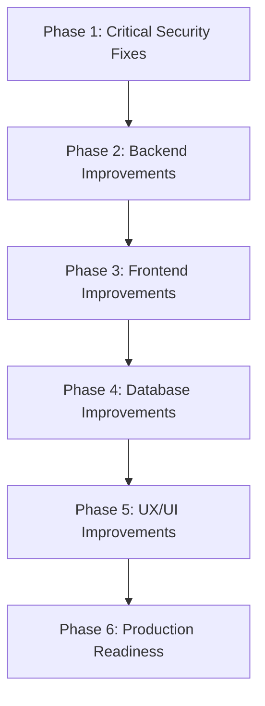

# DEVELOPMENT ROADMAP: E-Banking Security & Quality Enhancements

This document outlines the phased development roadmap to address security vulnerabilities, logical bugs, and technical debt identified in the [PROJECT_ANALYSIS.md](file:///E:/Apps/Sohan/E_PAY/e_banking/PROJECT_ANALYSIS.md).

---

## 🛠️ Implementation Strategy & Order

To minimize breaking changes, the implementation order is prioritized based on **risk level** and **dependency hierarchy**. Critical security fixes (such as IDOR and CORS) must be addressed first, followed by data-consistency fixes, UI adjustments, and final code cleanup.

### 🚨 Prerequisites (Complete Before New Features)
The following tasks are classified as **gatekeepers** and must be implemented before any functional extensions are started:
1.  **Task 1.1:** Fix IDOR Vulnerability (API endpoint protection).
2.  **Task 1.2:** Resolve Cryptographic Key Exposure (In-memory token management).
3.  **Task 2.1:** Atomic Database Transaction Checks (Prevent key desynchronization).
4.  **Task 6.2:** Revoke and Rotate Committed Supabase Service Role Keys.

---

## 📅 Phases of Implementation

### PHASE 1: Critical Security Fixes

#### Task 1.1: Fix IDOR Vulnerability on Profile, Transactions, and Notifications
*   **Task ID:** `TSK-1.1`
*   **Priority:** Critical
*   **Description:** The endpoints `/user/<username>`, `/transactions/<username>`, and `/notifications/<username>` authenticate that the caller has a valid session token, but do not verify that the token belongs to the username in the request path. Modify the backend to validate that the token owner matches the path parameter.
*   **Files to Modify:**
    *   [backend/app.py](file:///E:/Apps/Sohan/E_PAY/e_banking/backend/app.py)
*   **Complexity:** Low
*   **Dependencies:** None
*   **Expected Result:** An authenticated user attempting to query another user's username receives a `403 Forbidden` response.
*   **Testing Requirements:**
    *   Login as `tester1` and retrieve their token.
    *   Send a GET request to `/transactions/tester2` passing the `tester1` token.
    *   Assert the API returns a `403 Forbidden` error.

#### Task 1.2: Resolve Cryptographic Key Exposure in the Browser
*   **Task ID:** `TSK-1.2`
*   **Priority:** Critical
*   **Description:** The backend currently sends the raw cryptographic keys ($K1$, $K2$, and $BP$) to the frontend during login, which stores them in `localStorage`. This violates key isolation principles and exposes the keys to XSS attacks. Update the frontend session model to store these keys in a transient in-memory state (such as a React Context) rather than persistent `localStorage`.
*   **Files to Modify:**
    *   [frontend/src/utils/session.ts](file:///E:/Apps/Sohan/E_PAY/e_banking/frontend/src/utils/session.ts)
    *   [frontend/src/app/screens/Login.tsx](file:///E:/Apps/Sohan/E_PAY/e_banking/frontend/src/app/screens/Login.tsx)
    *   [frontend/src/app/screens/TransactionProcessing.tsx](file:///E:/Apps/Sohan/E_PAY/e_banking/frontend/src/app/screens/TransactionProcessing.tsx)
*   **Complexity:** Medium
*   **Dependencies:** None
*   **Expected Result:** Session keys ($K1$, $K2$, and $BP$) are loaded dynamically on login, held in memory, and cleared immediately when the tab is closed, reloaded, or the user logs out.
*   **Testing Requirements:**
    *   Log in and verify browser `localStorage` contents. Confirm that only the session token is persistently stored.
    *   Confirm that transactions still succeed using the in-memory keys.

---

### PHASE 2: Backend Improvements

#### Task 2.1: Transactional Atomic Checks for Timestamp Synchronization
*   **Task ID:** `TSK-2.1`
*   **Priority:** High
*   **Description:** If database updates for the transaction timestamp ($T$) or daily limit fail, the transaction is currently still recorded as successful, causing a timestamp mismatch that locks the user out of future transactions. Wrap updates to the user's timestamp and balance in a transaction block. If any step fails, roll back the transaction and return a `500 Internal Server Error`.
*   **Files to Modify:**
    *   [backend/app.py](file:///E:/Apps/Sohan/E_PAY/e_banking/backend/app.py)
*   **Complexity:** Medium
*   **Dependencies:** None
*   **Expected Result:** System failures roll back the database state, keeping the client and server timestamps synchronized.
*   **Testing Requirements:**
    *   Mock a database failure during the timestamp update phase.
    *   Verify the API returns a 500 error and the transaction is not committed.

#### Task 2.2: Fix SPA Catch-all Routing for Malicious Payloads
*   **Task ID:** `TSK-2.2`
*   **Priority:** Medium
*   **Description:** Flask's SPA routing fallback currently serves `index.html` with a `200 OK` status for malicious URL parameters (like path traversal or script tags) on API paths. Add input validation rules on the catch-all handler to reject malicious paths before serving static assets.
*   **Files to Modify:**
    *   [backend/app.py](file:///E:/Apps/Sohan/E_PAY/e_banking/backend/app.py)
*   **Complexity:** Low
*   **Dependencies:** None
*   **Expected Result:** Requesting an API path with path traversal or script tags returns a `400 Bad Request` or `404 Not Found` response instead of the SPA landing page.
*   **Testing Requirements:**
    *   Send requests to `/check-receiver/../../../etc/passwd` and verify the server returns a 400 or 404 response.

---

### PHASE 3: Frontend Improvements

#### Task 3.1: Fix TransactionCard Incoming Transaction Bug
*   **Task ID:** `TSK-3.1`
*   **Priority:** High
*   **Description:** `TransactionCard` currently defaults to displaying all transactions as outgoing (`-৳` with the recipient's username). Update the component to accept a transaction type (e.g. `'sent'` vs `'received'`) and dynamically adjust colors, labels, and usernames accordingly.
*   **Files to Modify:**
    *   [frontend/src/app/components/TransactionCard.tsx](file:///E:/Apps/Sohan/E_PAY/e_banking/frontend/src/app/components/TransactionCard.tsx)
*   **Complexity:** Low
*   **Dependencies:** None
*   **Expected Result:** Received payments display with a green `+৳` indicator showing the sender's username, while sent payments display with a black/red `-৳` showing the recipient's username.
*   **Testing Requirements:**
    *   Generate test data containing both sent and received transactions.
    *   Verify the dashboard list formats received transactions correctly.

#### Task 3.2: Use Server-Returned Balance Instead of Local Calculations
*   **Task ID:** `TSK-3.2`
*   **Priority:** Medium
*   **Description:** The client currently updates the user's balance locally by subtracting the transaction amount from the stored balance, which can lead to stale data. Update the client to set the balance using the `new_balance` value returned in the API response.
*   **Files to Modify:**
    *   [frontend/src/app/screens/TransactionProcessing.tsx](file:///E:/Apps/Sohan/E_PAY/e_banking/frontend/src/app/screens/TransactionProcessing.tsx)
*   **Complexity:** Low
*   **Dependencies:** `TSK-2.1`
*   **Expected Result:** The client balance updates to match the server's post-transaction balance.
*   **Testing Requirements:**
    *   Complete a transaction and verify the updated dashboard balance matches the database state.

#### Task 3.3: Handle Missing Timestamp Safely in Success Navigation
*   **Task ID:** `TSK-3.3`
*   **Priority:** Medium
*   **Description:** The client currently blocks navigation to the success screen if `new_t` is missing, which can cause the app to get stuck even if the transaction succeeded. Modify the success check to navigate if `status === 'success'` and update the timestamp if `new_t` is present.
*   **Files to Modify:**
    *   [frontend/src/app/screens/TransactionProcessing.tsx](file:///E:/Apps/Sohan/E_PAY/e_banking/frontend/src/app/screens/TransactionProcessing.tsx)
*   **Complexity:** Low
*   **Dependencies:** None
*   **Expected Result:** The application navigates to the success page on successful transactions even if the new timestamp `new_t` is missing from the response.
*   **Testing Requirements:**
    *   Mock the API response to omit `new_t` but return `status: 'success'`.
    *   Verify the application still navigates to the success screen.

---

### PHASE 4: Database Improvements

#### Task 4.1: Enforce Row-Level Security (RLS) Policies on Supabase
*   **Task ID:** `TSK-4.1`
*   **Priority:** Medium
*   **Description:** Review and enforce Row-Level Security (RLS) policies on the Supabase database. Ensure direct queries using the client anon key are restricted to reading data belonging to the authenticated user's ID.
*   **Files to Modify:**
    *   [database/SUPABASE_NEW_DATABASE_SETUP.sql](file:///E:/Apps/Sohan/E_PAY/e_banking/database/SUPABASE_NEW_DATABASE_SETUP.sql)
*   **Complexity:** Medium
*   **Dependencies:** None
*   **Expected Result:** Direct REST queries using the anon key to read profiles or transactions belonging to other users return empty datasets.
*   **Testing Requirements:**
    *   Authenticate as `tester1` and send a REST query to `/rest/v1/profiles?id=eq.tester2-uuid` using the anon key.
    *   Verify the database returns an empty list.

---

### PHASE 5: UX/UI Improvements

#### Task 5.1: Dynamic Header Title Mapping on Quick Actions
*   **Task ID:** `TSK-5.1`
*   **Priority:** Low
*   **Description:** Dashboard quick actions like Utilities and Market currently redirect to `SendMoney.tsx` but keep the header title "Send Money". Update the screen to dynamically set the header title based on the route state (e.g. "Utility Payment").
*   **Files to Modify:**
    *   [frontend/src/app/screens/SendMoney.tsx](file:///E:/Apps/Sohan/E_PAY/e_banking/frontend/src/app/screens/SendMoney.tsx)
    *   [frontend/src/app/screens/Dashboard.tsx](file:///E:/Apps/Sohan/E_PAY/e_banking/frontend/src/app/screens/Dashboard.tsx)
*   **Complexity:** Low
*   **Dependencies:** None
*   **Expected Result:** Selecting "Utilities" displays "Utility Payment" as the page header, while "Send Money" remains the default.
*   **Testing Requirements:**
    *   Navigate to the payment screen from the "Utilities" dashboard action and verify the header title.

#### Task 5.2: Eliminate Race Conditions in Transaction Loading Animations
*   **Task ID:** `TSK-5.2`
*   **Priority:** Low
*   **Description:** `TransactionProcessing.tsx` uses artificial delays during the cryptographic steps. If the user closes the app during this window, they may not see the success screen. Optimize the loading animations to transition immediately upon receiving the API response.
*   **Files to Modify:**
    *   [frontend/src/app/screens/TransactionProcessing.tsx](file:///E:/Apps/Sohan/E_PAY/e_banking/frontend/src/app/screens/TransactionProcessing.tsx)
*   **Complexity:** Low
*   **Dependencies:** None
*   **Expected Result:** The application navigates to the result screen immediately after the API call completes, reducing the risk of a race condition.
*   **Testing Requirements:**
    *   Verify the application navigates immediately to the results page once the API response is received.

---

### PHASE 6: Production Readiness

#### Task 6.1: Clean Up Unused UI Components
*   **Task ID:** `TSK-6.1`
*   **Priority:** Low
*   **Description:** The directory `frontend/src/app/components/ui/` contains over 40 unused shadcn components. Remove these components to clean up the codebase and reduce the bundle size.
*   **Files to Modify:**
    *   Delete unused files in `frontend/src/app/components/ui/`
*   **Complexity:** Low
*   **Dependencies:** None
*   **Expected Result:** Unused files are removed, reducing the overall codebase size.
*   **Testing Requirements:**
    *   Verify the frontend build command completes successfully after deleting the files.

#### Task 6.2: Restrict CORS Policies and Rotate Environment Secrets
*   **Task ID:** `TSK-6.2`
*   **Priority:** High
*   **Description:** Restrict CORS policies on the Flask backend to allow requests only from authorized domains. Rotate the committed Supabase service role key to secure the database.
*   **Files to Modify:**
    *   [backend/app.py](file:///E:/Apps/Sohan/E_PAY/e_banking/backend/app.py)
    *   [backend/.env.backend](file:///E:/Apps/Sohan/E_PAY/e_banking/backend/.env.backend)
*   **Complexity:** Medium
*   **Dependencies:** None
*   **Expected Result:** Requests from unauthorized domains are blocked by CORS. The Supabase service role key is rotated and removed from version control.
*   **Testing Requirements:**
    *   Verify that API requests from unauthorized origins are rejected.
    *   Verify that database access is restricted after key rotation.
